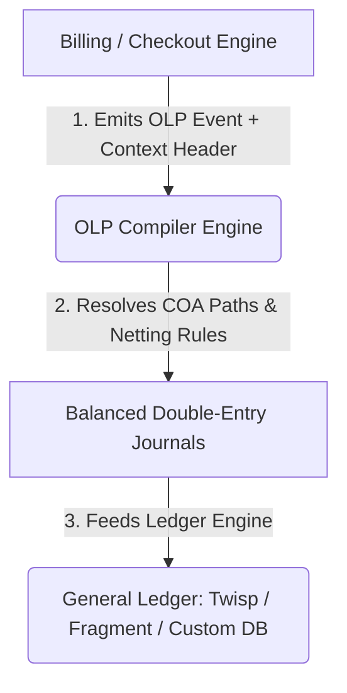

# Open Ledger Protocol (OLP)
## A Metadata-Driven Specification for Decoupled Double-Entry Financial Ledger Compilation
**Version 1.0.0-draft**

---

### Abstract
Modern software architectures often build financial databases by hardcoding double-entry accounting rules (debits and credits) directly into application code and relational SQL tables. This design couples transactional software developers with certified public accountants (CPAs), creating code fragile to changes in tax jurisdictions, operating segments, or GAAP/IFRS standards. 

The **Open Ledger Protocol (OLP)** introduces a standardized, metadata-driven event protocol that decouples billing and checkout engines from core general ledgers. By wrapping transaction payloads with standardized accounting context headers (e.g., `role`, `recognition`, `payment_method`), OLP compiles business events into balanced, audit-compliant double-entry ledger journals dynamically. This whitepaper details the design patterns, mathematical models, and operational structures of OLP Version 1.0.

---

## 1. Introduction: The Double-Entry Dilemma

Most software applications log transactions using simple ledger-style rows:
```sql
INSERT INTO transactions (order_id, user_id, amount) VALUES ('ord_123', 'usr_456', 100.00);
```
While sufficient for initial operations, this format lacks audit compliance at scale. Under modern accounting frameworks (such as US GAAP and IFRS), a single payment receipt of $100.00 is rarely recorded as flat revenue. Instead:
1. If the item is physical: Revenue is recognized **point-in-time** upon delivery, but cash is held in deferred accounts or clearing accounts until carrier confirmation.
2. If the item is a subscription: Revenue is deferred and recognized **over-time** (amortized ratably) over the contract term (e.g. $8.33 per month for 12 months).
3. If merchant processing fees are subtracted: Cash received is logged net, with the fee debited to processing expenses.
4. If sales taxes (VAT) are collected: The tax portion must be isolated and credited to a liability account matching the client's local tax jurisdiction (e.g. Germany vs. US).

Traditionally, developers hardcode this mapping logic inside the checkout microservice. When accounting guidelines change (e.g. a transition from ASC 606 to IFRS 15 rules), developers must modify database schemas and application logic. OLP solves this by separating **transaction creation** (business events) from **ledger compilation** (CPA ledger entries).

---

## 2. The OLP Paradigm

OLP establishes a middleware compiler layer that acts like an "HTTP header parser" for accounting. Applications emit generic, immutable events containing transactional detail, annotated with an `accounting_context` header:



### 2.1 The Accounting Context Header
By decoupling account paths, OLP relies on standard headers to dictate ledger routing:

*   `role` (`"principal"` | `"agent"`): Dictates whether gross sales are recorded as revenue (principal) or if only platform commissions are logged (agent under ASC 606).
*   `recognition` (`"point_in_time"` | `"over_time"`): Determines if revenue matches payment timestamp or is amortized.
*   `is_intercompany` (`true` | `false`): Flags internal transactions between sister entities to ensure consolidated parent accounts ignore double-counted revenues (ASC 810).
*   `coa_overrides`: Map brand-specific account overrides dynamically, decoupling the compiler from hardcoded accounts.

---

## 3. Core Compilation Logic & Mathematical Models

OLP runs double-entry arithmetic in **minor currency units (integers)** to eliminate IEEE 754 floating-point rounding errors. For any compiled transaction, the sum of debits must exactly equal the sum of credits:

$$\sum \text{Debits} = \sum \text{Credits}$$

### 3.1 Proportional Coupon/Discount Allocations
Under ASC 606 Step 3, transaction-level discounts must be allocated proportionally across line items based on relative selling prices before revenue rules execute.

For a transaction with total price $P_{\text{total}}$, discount $D$, and line item price $p_i$, the allocated discount $d_i$ is:

$$d_i = \left\lfloor \frac{D \times p_i}{P_{\text{total}}} \right\rfloor$$

Any remaining rounding remainder is swept into the final line item:

$$d_{\text{last}} = D - \sum_{i=1}^{n-1} d_i$$

### 3.2 Sales Returns Reserves
For merchants anticipating returns, recognizing 100% of revenue is prohibited (ASC 606-10-55-22). If expected return rate is $R$ basis points (where $1 \text{ bps} = 0.01\%$):

*   **Refund Liability (Reserve)**:
    $$\text{Refund Reserve} = \left\lfloor \frac{\text{Base Price} \times R}{10000} \right\rfloor$$
*   **Net Revenue Recognized**:
    $$\text{Net Revenue} = \text{Base Price} - \text{Refund Reserve}$$
*   **Right to Recover Returned Assets**:
    $$\text{Right to Recover Asset} = \left\lfloor \frac{\text{COGS Estimate} \times R}{10000} \right\rfloor$$
*   **Net Cost of Goods Sold**:
    $$\text{Net COGS} = \text{COGS Estimate} - \text{Right to Recover}$$

Ledger entries:
```text
Debit: /assets/liquid/cash (Gross Amount)
Credit: /equity/revenue/gross (Net Revenue)
Credit: /liabilities/refund_reserve (Refund Reserve)
Debit: /expenses/cogs (Net COGS)
Debit: /assets/receivables/right_to_recover (Right to Recover)
Credit: /assets/inventory (Total COGS)
```

---

## 4. Multi-Element Bundles & Line-Item Overrides
When distinct performance obligations (POBs) are sold in a single transaction (e.g. Kindle Device + 12-Month SaaS Subscription), they must be recognized under different rules:

1.  **Device (Point-in-Time)**: Recognized immediately upon shipping.
2.  **SaaS (Over-Time)**: Recognized ratably monthly over 12 months.

OLP resolves this by allowing localized `accounting_context` overrides at the individual `line_items` level. 

To prevent compilation recursion, the compiler executes a two-pass sweep:
*   **First Pass**: Distributes transaction-level taxes and processing fees proportionally across all line items, then generates isolated sub-events.
*   **Second Pass**: Aggregates the entries into a single transaction, applying a ledger-netting sweep to merge entries targeting duplicate accounts (e.g. combining cash debits to `/assets/liquid/cash` into a single line).

---

## 5. Post-Fulfillment Adjustments
Standard accounting ledgers cannot modify posted records. Instead, OLP enforces immutable adjustments using standard event types:

*   **`revenue_adjustment_posted` (Variable Consideration)**: Adjusts recognized revenue (e.g., volume-based rebates) by debiting `/equity/revenue/refunds_allowances` and crediting A/R or Cash directly.
*   **`invoice_voided` (Invoice Cancellation)**: Directly cancels a billed invoice before bad debt is accrued, reversing the Gross Revenue and Tax liabilities against A/R.
*   **`accrual_reversed` (Accrual Reversal)**: Reverses vendor payables against gross revenue or cost of goods sold.

---

## 6. Conclusion & Roadmap
By decoupling ledger accounting rules from transactional codebases, OLP Version 1.0 establishes a robust, auditable standard for financial integration. 

Future revisions of the protocol will address:
1.  **Retroactive Contract Modifications**: Algorithmic calculations for cumulative catch-up vs. prospective treatment.
2.  **Tax Rate Engine Plugins**: Direct hooks into compliance API layers (e.g. Avalara or Vertex) for real-time tax liability updates.
3.  **Cryptographic Proof of Balance**: Generating Zero-Knowledge proofs for public audits without revealing underlying business numbers.
